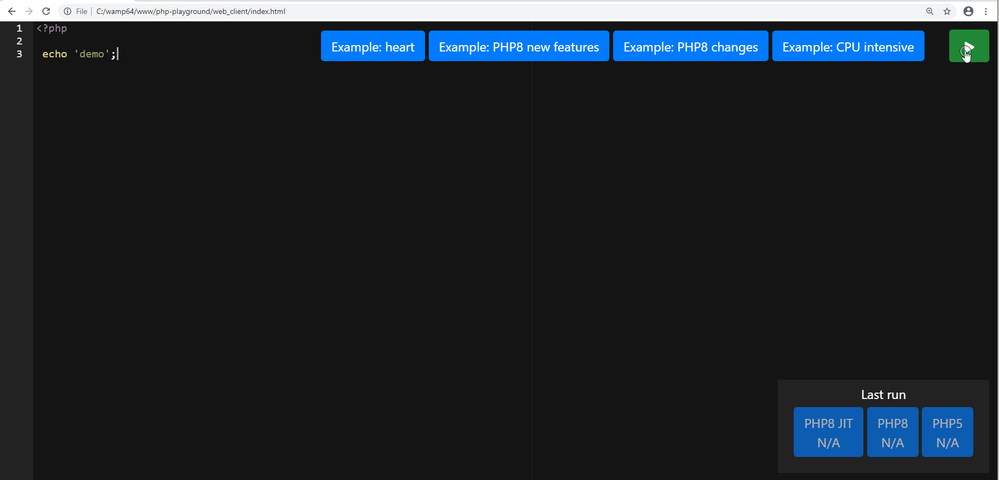

# Private PHP playground on AWS Lambda

## Intro

I have a stupid idea. Let's run a PHP code on AWS Lambda environment. Why, you may ask. Because it is fun, because we can :) and mainly because we may learn a thing or two along the way.

You may learn:

- AWS CLI basic usage
- How to build a binary to run it against AWS Lambda environment
- How to call a AWS Lambda function from JavaScript AWS SDK

To make at least some value out of this, we will set-up a basic local web-based PHP editor and a AWS Lambda PHP backend to execute the code we will enter into web-based editor. Basically, we will set-up a private PHP playground environment.

PHP8 is about to be released in few (4 or 5) months and it will support JIT.

I am all about the new technology and benchmarking, so we will run the same code against PHP5, PHP8 (without JIT support) and PHP8 (with JIT support) and compare the results.



Let's get our hands dirty.

## Initial notes

I've already built PHP8 and PHP5 binaries and I have put it into github repository (```php-8-bin``` and ```php-5-bin```). If you would like to build it yourself just folow the instrustions in section ```Build your own PHP binary to execute it on AWS Lambda envirnoment```.

## Pre-requirements

- Git :)
- AWS CLI (installed and configured) [Installation guide](https://docs.aws.amazon.com/cli/latest/userguide/install-cliv2.html) [Configuration guide](https://docs.aws.amazon.com/cli/latest/userguide/cli-chap-configure.html) 
- A basic knowledge of AWS cloud services 

## Deployment: AWS Lambda 

Cd into ```lambda``` directory

```
cd lambda
```

Step 1: Make binaries executable and crete a lambda package (zip)

<pre><code>sudo chmod -x php-8-bin/bin/php
sudo chmod -x php-5-bin/bin/php
zip <b style="color: green">package.zip</b> php-5-bin/* php-8-bin/* php.js 
</pre></code>

Step 2: Lambda stores logs in AWS CloudWatch service and it needs a parmission to be able to do so. We need to create a IAM role and attach the proper permission to it.

```
aws iam create-role --role-name RoleLambdaBasicExecute --assume-role-policy-document '{"Version": "2012-10-17","Statement": [{ "Effect": "Allow", "Principal": {"Service": "lambda.amazonaws.com"}, "Action": "sts:AssumeRole"}]}'

aws iam attach-role-policy --role-name RoleLambdaBasicExecute --policy-arn arn:aws:iam::aws:policy/service-role/AWSLambdaBasicExecutionRole
```
Step 3: Create a lambda function ```PHPPlayground```

<pre><code>aws lambda create-function --function-name PHPPlayground --zip-file fileb://<b style="color: green">package.zip</b> --handler php.handler --runtime nodejs12.x --role arn:aws:iam::<b style="color: red">[your-aws-account-id-goes-here]</b>:role/RoleLambdaBasicExecute
</pre></code>

Hint: To find out your AWS Account ID just run the command below: 
```
aws sts get-caller-identity
```
We've successfully deployed our lambda function. To test it out, try to run this command:

<pre><code>aws lambda invoke --function-name phptest --payload '{"php_source":"echo 4+5;"}' --cli-binary-format raw-in-base64-out response.json
</pre></code>

Step 4: We will need a permission to run a lambda function from our web-based PHP editor. We will create the new user ```UserPHPPlayground``` and attach a proper permission to it.

<pre><code>aws iam create-user --user-name UserPHPPlayground

aws iam create-policy --policy-name PolicyExecuteLambda --policy-document '{"Version": "2012-10-17","Statement": [{"Sid": "PHPExec","Effect": "Allow","Action": "lambda:InvokeFunction","Resource": "arn:aws:lambda:*:*:function:*"}]}'

aws iam attach-user-policy --user-name UserPHPPlayground --policy-arn arn:aws:iam::<b style="color: red">[your-aws-account-id-goes-here]</b>:policy/PolicyExecuteLambda
</pre></code>

Step 5: Now, we will create an access key. Save the output. We will use those two values in web-based PHP editor: ```AccessKeyId``` and ```SecretAccessKey```

```
aws iam create-access-key --user-name UserPHPPlayground
```

## Deployment: Local PHP editor

Cd into folder ```web_client```, open ```aws-data.js``` and edit configuration paramteres.

Open ```index.html``` in your favorite browser. You are ready to play with your private local PHP Playground.

## Clean-up AWS resources

<pre><code>aws lambda delete-function --function-name PHPPlayground

aws iam detach-role-policy --role-name RoleLambdaBasicExecute --policy-arn arn:aws:iam::aws:policy/service-role/AWSLambdaBasicExecutionRole
aws iam delete-role --role-name RoleLambdaBasicExecute

aws iam detach-user-policy --user-name UserPHPPlayground --policy-arn arn:aws:iam::<b style="color: red">[your-aws-account-id-goes-here]</b>:policy/PolicyExecuteLambda
aws iam delete-policy --policy-arn arn:aws:iam::<b style="color: red">[your-aws-account-id-goes-here]</b>:policy/PolicyExecuteLambda
aws iam delete-access-key --user-name UserPHPPlayground --access-key-id <b style="color: red">[access-key-id-created-in-step-5-goes-here]</b>
aws iam delete-user --user-name UserPHPPlayground
</pre></code>

## Build your own PHP binary to execute it on AWS Lambda envirnoment

Spin-up a AMI Linux 2 instance. Pick ```t2.medium``` as the EC2 instance type to have two cores and 4 GB of memory for faster PHP compilation times.

Step 1: Update the package manager and install the minimum necessary libraries to be able to compile PHP 
```
sudo yum update
sudo yum install -y gcc gcc-c++ build-essential autoconf bison re2c libxml2-dev libsqlite3-dev git
```

Step 2: Download the PHP source code
```
git clone https://github.com/php/php-src.git
```
Step 3: Run ```buildconf``` and ```configure```. Note: We will disable all PHP extensions except for ```opcache```. We need ```opcache``` to be able to use JIT.
```
cd php-src/
./buildconf
./configure --prefix=/home/ec2-user/php-8-bin/ --disable-all --enable-opcache
```
Step 4: Build the PHP
```
make -j2
make install
```
You can quickly confirm that PHP is working by running the following command
```
/home/ec2-user/php-8-bin/php -v
```
Step 5: Among other shared libraries PHP also need ```libcrypt.so.1``` to be able to run. This particular library is missing in AWS Lambda ```nodejs12.x``` runtime so we need to include it in our final lambda package.
```
cp /lib64/libcrypt.so.1 /home/ec2-user/php-8-bin/lib/libcrypt.so.1
```
Step 6: There is a lot of files we do not need to run/execute PHP, so we will remove all of those.
```
cd php-8-bin/
rm -r include/
rm -r php/
rm -r var/
rm -r lib/php/build/
rm bin/php-cgi 
rm bin/php-config 
rm bin/phpdbg 
rm bin/phpize
```
Step 7: To be able to test JIT feature we need to enable it in ```php.ini```
``` 
echo "zend_extension=opcache.so" >> lib/php.ini
echo "opcache.enable=1" >> lib/php.ini
echo "opcache.enable_cli=1" >> lib/php.ini
echo "opcache.jit_buffer_size=32M" >> lib/php.ini
echo "opcache.jit=1235" >> lib/php.ini
```

That's it. You are ready to transfere the folder ```php-8-bin``` to your machine and put it into AWS Lambda project folder.

## Resources

[Scripting Languages for AWS Lambda: Running PHP, Ruby, and Go](https://aws.amazon.com/blogs/compute/scripting-languages-for-aws-lambda-running-php-ruby-and-go/)

[AWS Lambda runtimes](https://docs.aws.amazon.com/lambda/latest/dg/lambda-runtimes.html)

[PHP RFC: JIT](https://wiki.php.net/rfc/jit)